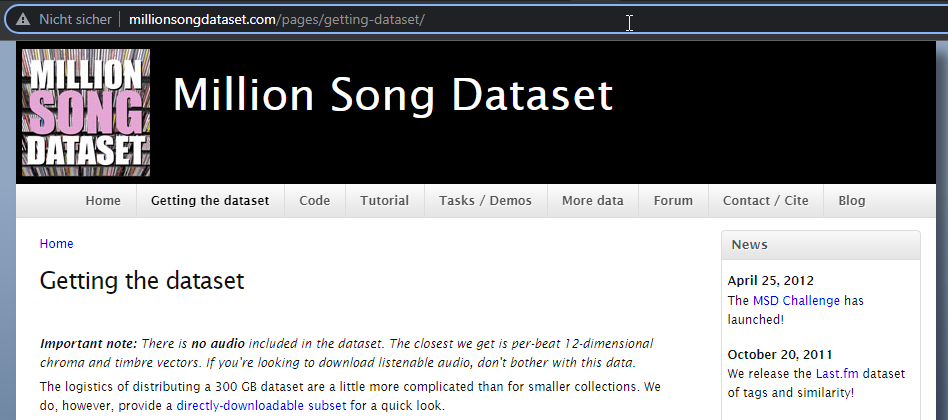
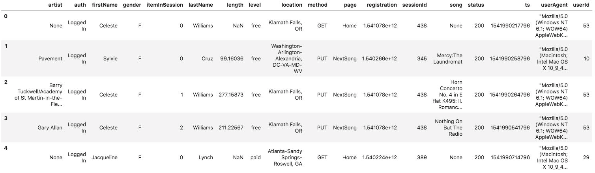
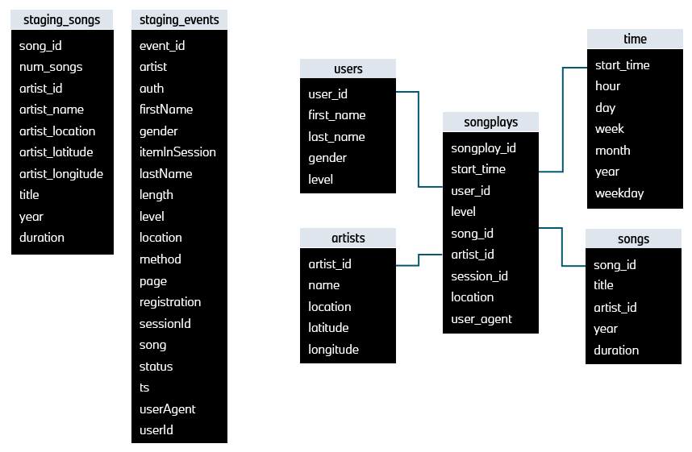
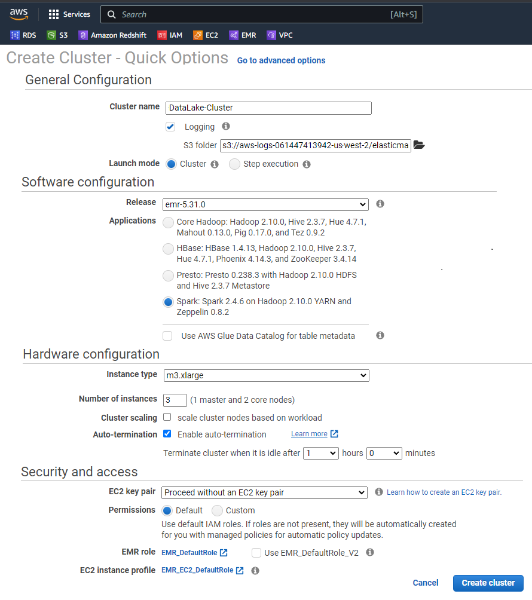

# Project Data Lakes with Spark and Amazon Web Services (AWS) 

## Summary
* [Introduction](#introduction)
* [Data Lake Schema](#data-lake-schema)
* [Files list](#files-list)
* [Additional information](#additional-information)
* [Getting Started](#getting-started)

## Introduction

This **UDACITY Nanodegree in DATA ENGINEERING** project has the purpose of exercise with Amazon Redshift to create the database `Sparkifydb` for a music app, *Sparkify*. The goal is to design a star schema optimized for queries on song play analysis. The database will be model with **song** and **log** datasets, originaly stored in JSON format and saved at the S3 Buckets, Amazon’s popular online storage system.  The data stages then in Redshift, and finaly transforms data into a set of fact and dimensional tables.


## Data Lake Schema

### Schema design and ETL pipeline

The star schema does consist of 1 *Fact* table (songplays) and 4 *Dimension* tables (users, songs, artists, time). The source files in JSON format of **songs** as well of **logs** are on the AWS cloud S3 storage at the corresponding subdirectories *`s3a://udacity-dend/songs_data`* as well *`s3a://udacity-dend/log_data`* available. The required information will be extracted from S3 (Amazon's popular storage system) via dataframe 'INSERTED' into the dedicated table.  


## Datasets used
The datasets used are retrieved from the s3 bucket and are in the JSON format. There are two datasets namely `log_data` and `song_data`. The `song_data` dataset is a subset of the the [Million Song Dataset](http://millionsongdataset.com/) while the `log_data` contains generated log files based on the songs in `song_data`.





<b>Song data structure</b>

```
song_data/A/A/A/TRAAAAW128F429D538.json
```
~~~~
{"num_songs": 1, "artist_id": "ARD7TVE1187B99BFB1", "artist_latitude": null, "artist_longitude": null, "artist_location": "California - LA", "artist_name": "Casual", "song_id": "SOMZWCG12A8C13C480", "title": "I Didn't Mean To", "duration": 218.93179, "year": 0}
~~~~

<b>Logs data structure</b>
~~~~
{"artist":"Poison The Well","auth":"Logged In","firstName":"Chloe","gender":"F","itemInSession":56,"lastName":"Cuevas","length":184.60689,"level":"paid","location":"San Francisco-Oakland-Hayward, CA","method":"PUT","page":"NextSong","registration":1540940782796.0,"sessionId":648,"song":"Riverside","status":200,"ts":1542413675796,"userAgent":"Mozilla\/5.0 (Windows NT 5.1; rv:31.0) Gecko\/20100101 Firefox\/31.0","userId":"49"}
~~~~
  
  
### Log dataset
The second dataset consists of log files in JSON format generated by this event simulator based on the songs in the dataset above. These simulate app activity logs from an imaginary music streaming app based on configuration settings.

The log files in the dataset you'll be working with are partitioned by year and month. For example, here are filepaths to two files in this dataset.

```
log_data/2018/11/2018-11-12-events.json
log_data/2018/11/2018-11-13-events.json
```

And below is an example of what the data in a log file, 2018-11-12-events.json, looks like.




Here an overview of the resulted star schema and database contruct:  




## Files list

Use this files for creation of the database Sparkifydb withhin the JUPITER Workplace with the required tables.  

Following is a list or required files to execute the project: 
* **dl.cfg** - configuration properties for (AWS) remote execution
* **etl.py** - main python script with `create_spark_session()`, `process_song_data()` and `process_log_data()`
* **README.md** - this file as project description
* **DataLake-Notebook.ipynb** - Jupyter Workbook: an overview as well an easy execution of ALL steps and scripts


## Getting Started 

### Prerequisites

- AWS Account
- Set your AWS access and secret key in the config file `dl.cfg`  
        ```  
        AWS_ACCESS_KEY_ID = <your aws key>  
        AWS_SECRET_ACCESS_KEY = <your aws secret>  
        ```  

## Setup an EMR on AWS - How to run this project on AWS EMR?

### Create a Data Lake with Spark and AWS EMR

To create an Elastic Map Reduce data lake on AWS, use the following steps:

1. Create a ssh key-pair to securely connect to the EMR cluster that we are going to create. Go to your EC2 dashboard and click on the key-pairs. Create a new one, you will get a .pem file that you need to use to securely connect to the cluster.

2. Next, we will create an EMR cluster with the following configuration. Here EMR operates Spark in YARN cluster mode and comes with Hadoop Distributed file system. We will use a 4 cluster node with 1 master and 3 worker nodes.



3. We will be using the default security group and the default EMR role `EMR_DefaultRole` for our purposes. Ensure that default security group associated with Master node has SSH inbound rule open, otherwise you won't be able to ssh. 

        
    
### Terminal commands 

* Execute the ETL pipeline script by running:
    ```
    $ python etl.py
    ```


<br>

Best regards  
UDACITY [Data-Engineering]  
Student "MrMorphy" [GitHub Profile](https://github.com/MrMorphy)

GitHub Project  
https://github.com/MrMorphy/udacity-course-proj-data-lake/blob/main/README.md

